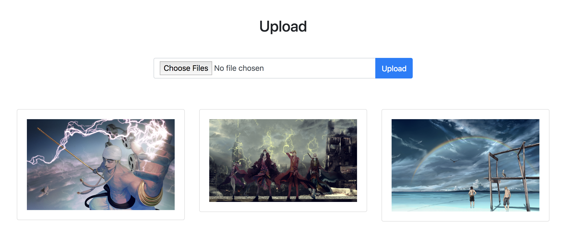

# AngularUploadFile

This project was generated with [Angular CLI](https://github.com/angular/angular-cli) version 7.0.4.

### Demo

## Download And Install

### git clone https://github.com/niawjunior/angular-upload-file.git
### cd angular-upload-file
### npm install

## Config
### mongodb url server at upload-api/server.js | uri variable

## Run
### Angular |  ng serve
### NodeJs API at upload-api folder | node server.js
